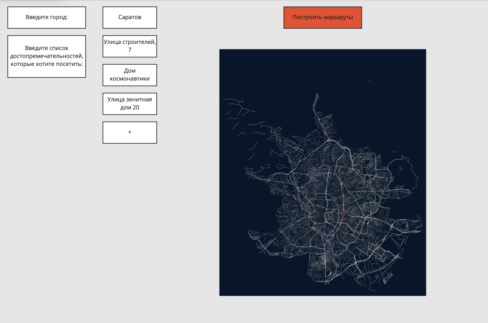

# PyMap

## Как настроить pre-commit хук
Установить нужные py пакеты:
```bash
pip install pydocstyle
pip install pylint
pip install black
```
Нужно выполнить следующую команду:
```bash
bash linters/pre-commit-hook
```
После этого все файлы, которые будут пытаться добавится в коммит, будут предварительно обрабатываться авто форматером black.
Потом проверяться линтером pylint.
Потом проверяться линтером pydocstyle.
Если какая-то проверка линтера не пройдет, коммит не будет завершен.

Examples:
Black formatter:
```bash
Start black formating...
All done! ✨ 🍰 ✨
1 file left unchanged.
Black formating success.
```
PyLint checker:
```bash
INFO:root:PyLint Starting | Path: ../pymap/ | Threshold: 10.0
************* Module pymap.lint
lint.py:1:0: C0114: Missing module docstring (missing-module-docstring)

------------------------------------------------------------------
Your code has been rated at 9.57/10 (previous run: 9.57/10, +0.00)

ERROR:root:PyLint Failed | Score: 9.565217391304348 | Threshold: 10.0
Traceback (most recent call last):
  File "lint.py", line 57, in <module>
    check_pylint()
  File "lint.py", line 48, in check_pylint
    raise Exception(message)
Exception: PyLint Failed | Score: 9.565217391304348 | Threshold: 10.0
```

PyDocStyle checker:
```bash
Start pydocstyle checker starting...
lint.py:1 at module level:
        D400: First line should end with a period (not 'r')
```

## Постановка решаемой задачи
- Конструктор маршрутов для гостей столицы.
- Человек хочет посетить несколько мест в Москве, программа строит маршрут для него, при котором он сможет за наикратчайшее время обойти все места и отрисовываем путь.

## Описание предполагаемых инструментов решения (Dependencies)
- `OSMPythonTools`
- `osmnx`
- `networkx`
- `...`

## Interface draft
- Предполагается, что пользователь сможет задать город;
- Дописать адреса, которые хочет посетить;
- Получить карту с маршрутом обхода всех мест, которые указал пользователь.



## Authors
- [Артем Барышев Владимирович](https://github.com/arteeemik)
- [Бондарев Иван Геннадьевич](https://github.com/BondarevIvan)
- [Мамаев Павел Вячеславович](https://github.com/BinaryDancer)